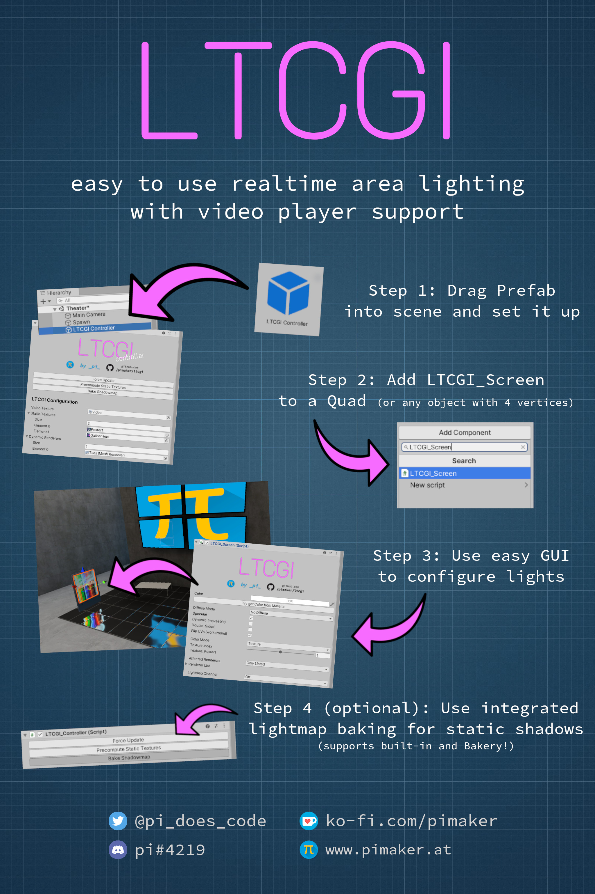

# LTCGI

Optimized plug-and-play realtime area lighting using the linearly transformed cosine algorithm for Unity/VRChat. Free to use with [attribution](#Attribution).

[Download UnityPackage](https://github.com/PiMaker/ltcgi/raw/main/ltcgi.unitypackage)

If you like this prefab, consider [supporting me on KoFi](https://ko-fi.com/pimaker)!

## Supported shaders

To use LTCGI, all objects that should receive lighting must use a compatible shader. Currently compatible ones are listed below. If you implement LTCGI into your shader, feel free to send a PR to be included.

* Basic "Unlit" Test Shader (included)
* Unity Standard Surface Shader (included)
* // TBA ~~[z3y's Simple Lit](https://github.com/pimaker/shaders) (custom fork)~~

## How to use



In written form:

* Put prefab into scene
* Optional: Set video render texture on the controller object (use [lox9973's VideoRT](https://drive.google.com/file/d/1XQBybXg2D87AueLI87UuujA3jDN4fU33/view) or similar for AVPro)
* Add LTCGI_Screen component to a quad or other MeshRenderer with 4 vertices
* Hit CTRL-S or use `Tools/LTCGI/Force Update` to update the editor representation
* Use GUI settings to configure your light, upload, enjoy :)

## Attribution

According to the [License](#License) you are free to use this in your world, but you need to give credit. You are free to do so in whichever way, but you must provide a link to this GitHub repository, such as to fulfill the imported license of the LTC example code used as a base for this project.

For your convenience, a prefab called `LTCGI Attribution` is provided in the package. If you don't want to use it, instead display text similar to the following:

```
This project/world uses LTCGI by _pi_, see 'github.com/pimaker/ltcgi'.
```

## Screenshots

.png)
.png)
.png)
.png)
.png)
.png)
.png)
.png)

## License

This project is made available under the terms of the MIT license, unless explicitly marked otherwise in the source files. See `LICENSE` for more.

The following files are licensed explicitly, and may not be modified or used in commercial projects, but can be redistributed and displayed otherwise, provided this license is kept:

* Propaganda/pi_graffiti.png
* Propaganda/ltcgi_graffiti.png