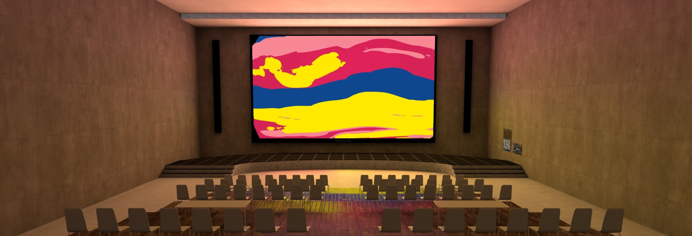
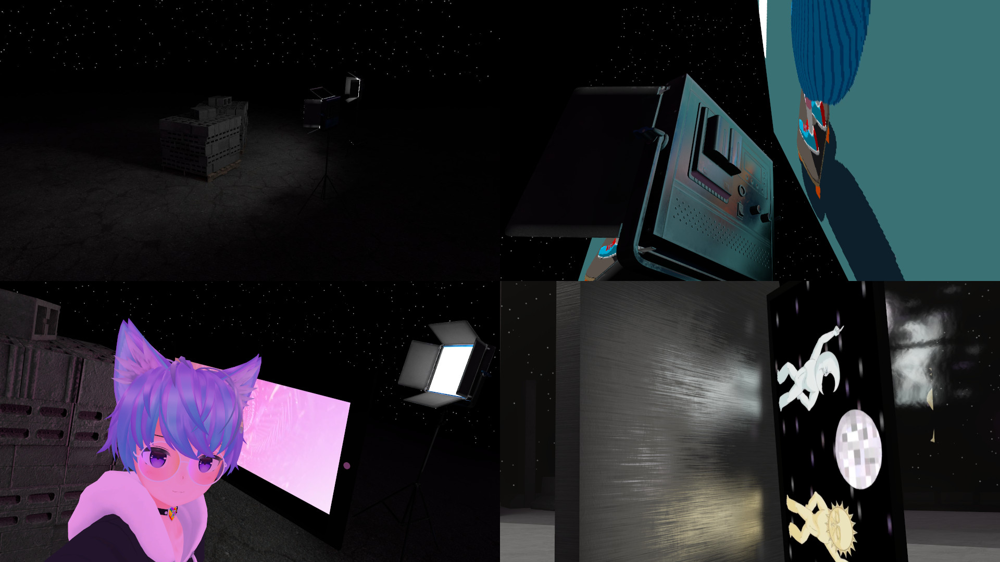
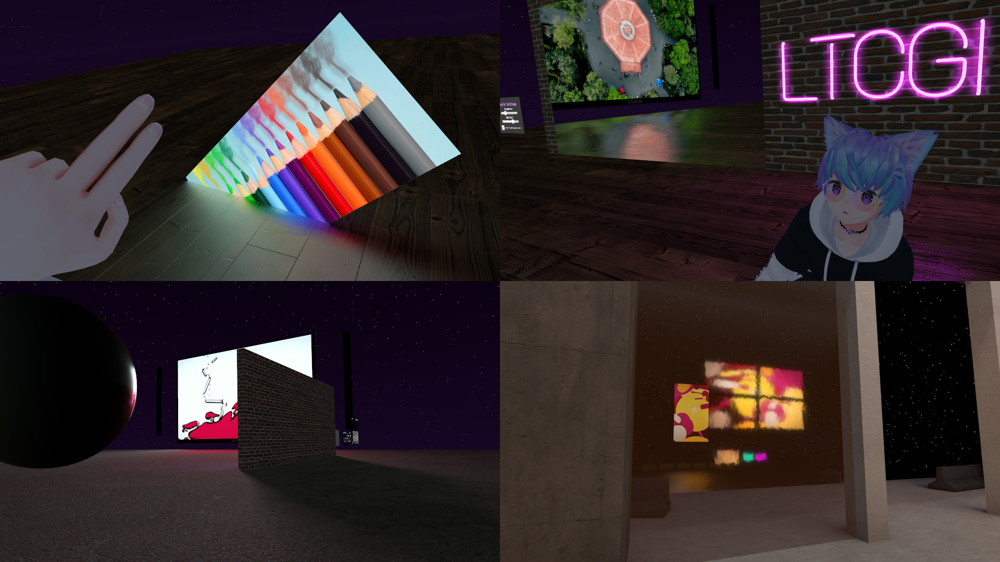

# LTCGI

Optimized plug-and-play realtime area lighting using the [linearly transformed cosine algorithm](#LTC) for Unity/VRChat. Free to use with [attribution](#Attribution).

**NOTE: While the shader is optimized, it still equates to real-time lighting - so use sparingly, and read the [Wiki](https://github.com/PiMaker/ltcgi/wiki) on performance optimization!**

If you like this prefab, consider [supporting me on KoFi](https://ko-fi.com/pimaker)!

Join the Discord for support or other questions: https://discord.gg/r38vJd2DuJ



  
(demo video by [@orels1](https://github.com/orels1))

## Supported shaders

To use LTCGI, all objects that should receive lighting must use a compatible shader. Currently compatible ones are listed below. If you implement LTCGI into your shader, feel free to send a PR to be included.

* [ORL Shader Family](https://shaders.orels.sh/) by [@orels1](https://github.com/orels1)
* Basic "Unlit" Test Shader (included)
* Surface Shader (included)

## How to use / Download

See the [Wiki](https://github.com/PiMaker/ltcgi/wiki) for instructions. Please check them out before using the prefab in your world!  
Also consider the [attribution requirements](#Attribution).

Check the [Releases](https://github.com/PiMaker/ltcgi/releases) tab for downloads.

### Dependencies
* [UdonSharp](https://github.com/MerlinVR/UdonSharp)
* [CyanEmu](https://github.com/CyanLaser/CyanEmu) (optional, but highly recommended)

## Attribution

According to the [License](#License) you are free to use this in your world, but you need to give credit. You are free to do so in whichever way, but you must provide a link to this GitHub repository, such as to fulfill the imported license of the LTC example code used as a base for this project.

For your convenience, a prefab called `LTCGI Attribution` is provided in the package.


If you don't want to use it, instead display text similar to the following:

```
This project/world uses LTCGI by _pi_, see 'github.com/pimaker/ltcgi'.
```

## LTC

Based on this paper:
```
Real-Time Polygonal-Light Shading with Linearly Transformed Cosines.
Eric Heitz, Jonathan Dupuy, Stephen Hill and David Neubelt.
ACM Transactions on Graphics (Proceedings of ACM SIGGRAPH 2016) 35(4), 2016.
Project page: https://eheitzresearch.wordpress.com/415-2/
```
[Read more](https://eheitzresearch.wordpress.com/415-2/)

## Screenshots

  
([LTCGI demo hall](https://vrchat.com/home/launch?worldId=wrld_aa2627ec-c63a-4db2-aa3e-9078d41c6d9c))

  
(venue designed by BananaBread)

  
(various surfaces)

  
(static textures, shadows and glass)

## License

This project is made available under the terms of the MIT license, unless explicitly marked otherwise in the source files. See `LICENSE` for more.

The following files are licensed explicitly, and may not be modified or used in commercial projects, but can be redistributed and displayed otherwise, provided this license is kept:

* Propaganda/pi_graffiti.png
* Propaganda/ltcgi_graffiti.png
