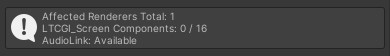
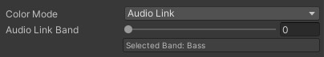

# 🎵 Audiolink

[AudioLink](https://github.com/llealloo/vrc-udon-audio-link) is a VRChat specific solution to make audio-reactive visuals. When installed, your LTCGI Controller will detect support for AudioLink and show it in the ℹ️ Info panel:

(You _may_ need to click "Re-Detect AudioLink" if you import it after LTCGI before you can use it.)

## Using it on LTCGI Screen or Emitter components

When available, a new color mode will become available on your light emitting components:

You can use the slider to select which band it should react to. At the moment, only basic support is available, meaning your light will flash with its color in the intensity of the selected band.