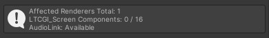
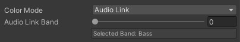

# 🎵 Audiolink

[AudioLink](https://github.com/llealloo/vrc-udon-audio-link) is a VRChat specific solution to make audio-reactive visuals. When installed, your LTCGI Controller will detect support for AudioLink from either the package path or the older `Assets/AudioLink` path and show it in the ℹ️ Info panel:

(You _may_ need to click "Re-Detect AudioLink" if you import it after LTCGI before you can use it.)

## Using it on LTCGI Screen or Emitter components

When available, a new color mode will become available on your light emitting components:

You can use the slider to select which band it should react to: `Bass`, `Low Mids`, `High Mids` or `Treble`. The delay field offsets the AudioLink sample used for the light. The options and effects match the "Audio Reactive Surface" shader included with AudioLink.

You can change the band at runtime with `_SetALBand` in the [UdonSharp API](/Advanced/Udon_Sharp_API).
