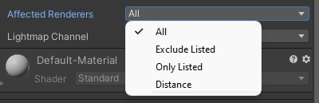

# ⚡ Performance Optimization

LTCGI is optimized as best as I could. _However_, it is still realtime lighting, and thus limited in how fast it can get. As a rule of thumb, LTCGI scales by `Screens per Receiving Objects`, with the caveat that transparent receiving objects double the cost due to overdraw.

This page lists several performance tricks and pitfalls that you should keep in mind designing your scenes.

---

## Reduce Screens

To keep performance good, avoid transparent objects lit by LTCGI and use as little screens as possible. Use UV mapping and the fact that LTCGI reflections are generally blurry to reduce screens.

As an example, the screen in this image is _one single wide_ `LTCGI_Screen`, completely ignoring the 3 black bars seperating it into "4" screens. This works, because the blurriness of the reflection would make those 3 seperators invisible anyway - but has a quarter of the rendering cost!

Note that this specifically means "reduce objects that are affected by multiple screens". You can technically have many more screens at little cost, if you can ensure that no object is lit by multiple at once. Remember, performance scales by `Screens per Receiving Objects`, not just Screens alone.

> ⚠️ On that note, keep in mind that the slowest pixel on your screen determines your overall GPU timing (big asterisk here, but it's a good approximation). That is, if you have 99% of pixels on your screen affected by 1 screen, but 1% is lit by 4, then performance will be as if everything is lit by 4 screens.

---

## Configure "Affected Renderers"

If you have more than one screen, it is imperative to clearly define which screen affects which objects in your scene. You can do this via the "Affected Renderers" setting.

"Exclude Listed" and "Only Listed" give you direct control over which GameObjects are affected, while "Distance" automatically selects nearby objects. "Distance" is the default, and will draw a nice bounding sphere if you have "Gizmos" enabled in your editor:

---

## Diffuse Lighting

Diffuse Lighting can have a distinct performance impact. As a first test, I recommend turning it off on the `LTCGI_Screen` component and checking if your scene still looks how you expect. The effect of Diffuse lighting can often be quite minimal, but cost a lot of performance. If you need Diffuse, consider "Lightmap Diffuse", it is cheaper and often looks better, but requires [Shadowmaps](/Advanced/Shadowmaps) to be baked.

---

## "Dynamic" Screens

It is recommended to turn off "Dynamic" on any `LTCGI_Screen` that will neither move nor change color\* during runtime (e.g. a static TV screen).

If all screens in a scene are non-dynamic, LTCGI will automatically switch to a slightly faster way of pushing data to the GPU, which can lead to better frame times.

\* "color" here referring to the "Color" setting itself, the _actual_ color can change with the video even if "Dynamic" is off

---

## Advanced Settings

On the LTCGI Controller there are some advanced settings under the "Global Shader Options" heading that can help with performance. These reduce feature set (e.g. disabling moveable screens entirely or no specular/diffuse lighting) but improve performance overall.

(The first 2 options in the screenshot are no longer available, as they are now calculated and set automatically to give you the best performance possible.)

Don't forget to hit "Apply"!

