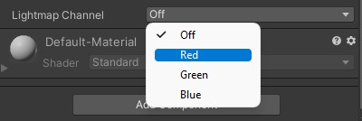
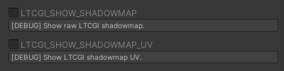

# 🕶️ Shadowmaps

Shadowmap baking allows LTCGI screens to have realistic shadows cast on static, non-moving objects. It follows the same rules as regular lightmap baking in Unity.

It also makes for cheaper and more realistic Diffuse lighting, if your screens are set to `Lightmap Diffuse` mode.

> ⚠️ That being said, shadowmap baking is a _very cursed_ process, because Unity does not handle lighting data in any remotely graceful way, and as such can often lead to bugs 🪲, frustration 💢 and broken scenes 🌩️. You have been warned.

## Set up your scene

Shadowmap baking follows the same rules as lightmap baking, that means any object that should receive lighting (well, shadows) has to be set as "Static" in the editor. "Lightmap scale" is also respected.

## Set up your `LTCGI_Screen` or `LTCGI_Emitter` components

To include your screen (or emitter!) component in shadowmap calculations, you need to give it a lightmap channel to work with. These _should_ be used as "one channel per screen", but can also be combined (since there's only 3 of them). Combining lightmap channels means that shadows will be cast from both screens at once. This should only be used for screens that are either far enough apart that their shadows don't overlap, or ones that are so close and in the same plane that their shadows are cast almost the same (e.g. 2 stacked screens at only a slight angle to each other). The color of the channel is arbitrary and will not affect rendering, treat them as names only.

"Lightmap Intensity" can be used to specify how bright the screen will be baked. This must be set _before_ baking.

See also the "Intensity" and "Multiplier" settings on the LTCGI Controller object.

### Light Mesh Support

LTCGI v1.0.2 and higher support baking with Bakery "Light Mesh" components. Simply put a Light Mesh component on the same GameObject as an `LTCGI_Screen` component and it will bake using its settings instead of a normal emissive material. Depending on your scene, this _may_ result in better or worse baking results. YMMV.

## Start the Bake

Use the "Bake Shadowmap" or "Bake Shadowmap and Normal Lightmap" buttons on the Controller to start a bake. The latter will follow the shadowmap bake with a normal one. This is something you need to do anyway, unless you want to visualize the shadowmaps, as they will otherwise be shown instead of your normal lightmaps in the scene.

You can use the "Clear Baked Data" button to undo a shadowmap bake and go back to unshadowed LTC only.

**The entire process in video form:**

<video controls loop width="100%">
  <source src="/vid/bake_shadowmaps.webm"/>
</video>

## Bakery

If you have [Bakery](https://assetstore.unity.com/packages/tools/level-design/bakery-gpu-lightmapper-122218) installed you will get a pop-up asking you if you want to use it instead of the built-in lightmapper when you hit "Bake Shadowmap". The choice is yours, but I do recommend at least doing one normal bake with Bakery to get the settings right before attempting a shadowmap bake with it enabled.

## Troubleshooting

Check the [FAQ](/FAQ) first for any general issues. Check the Unity Console for any errors. Whatever it is that isn't working, make sure it works _without_ a shadowmap first (use the "Clear Baked Data" button if necessary).

The LTCGI Controller has a few advanced debug options you can check out as well:

Don't forget to hit "Apply" after changing them, and make sure to reset them after testing.

You can also check the generated lightmaps in `_pi_\_LTCGI-Generated\Lightmaps-{your-scene-name}`. These should look like normal lightmaps casting light outwards from your screens.

During the bake your screens should show up in either Red, Green or Blue, depending on which lightmap channel they are set to.

Make sure a normal lightmap bake works first, and that all objects that are correctly marked as "static" receive their lightmaps.

If a bake fails or is aborted, and your scene ends up in a weird state (e.g. your screens are still showing as Red/Green/Blue), you can use the "DEBUG: Force Settings Reset after Bake" button to reset your scene. This button should be safe to press at any time, other than during a bake.

Sacrifice a goat at exactly midnight while looking eastwards, or westwards if you're in the southern hemisphere. Make sure the lightmap channel of the goat is set to M̴̨͒ȃ̴̹g̵͇̏e̸̼͑ṋ̴͋t̷̜̎ä̵͔́ .