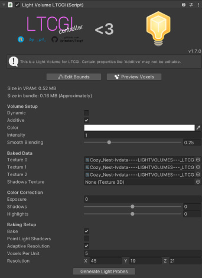

# 💡 VRC Light Volumes

LTCGI can render baked LTCGI shadowmap data into [VRCLightVolumes](https://github.com/REDSIM/VRCLightVolumes). This is useful for avatar lighting in VRChat worlds, because it lets Light Volume compatible shaders pick up LTCGI lighting without requiring dedicated LTCGI shaders on every avatar.

This integration only exists when VRCLightVolumes is installed and the `VRC_LIGHT_VOLUMES` scripting define is available. If the Light Volumes package is not installed, these components will not be active.

To install Light Volumes, follow the regular installation instructions on [GitHub](https://github.com/REDSIM/VRCLightVolumes). ⚠️ **Familiarity with non-LTCGI Light Volumes is required!**

:::warning

You will need at least VRCLV version `v.3.0.0-dev.1`, for which you may need to enable "Prerelease Packages" in VCC. The effect will show on avatars and dynamic objects using older VRCLV versions too, once built.

:::

## Comparison to VRCLV Area Lights

VRC Light Volumes also supports area lights, including with a color texture. There are pros and cons to using it vs LTCGI.

- VRCLV only provides diffuse lighting, including on static world objects. LTCGI can provide specular, i.e. mirror-like or watery surfaces, on anything bakeable.
- LTCGI supports Light Volume compatible shaders on versions older than `v.3.0.0`. You need VRCLV 3 to build your world, but the effect will work on older, already uploaded content such as avatars.
- VRCLV area lights may be marginally faster.
- VRCLV area lights operate diffuse per-pixel, while LTCGI's LV integration operates per-voxel, meaning the detail quality of lighting will be higher on VRCLV's version. On static objects in the world (bakeable), the per-pixel LTC algorithm will still look the same or better, however.

Either approach will perform well and can look great. The right choice will be down to your scene's requirements, or existing setup.

For advanced setups, you may be able to mix and match LTCGI and VRCLV area lights, but care needs to be taken to not double-up lighting on any objects.

## Setup

First, set up LTCGI and VRCLightVolumes normally in the same scene. You need a `LightVolumeManager` in the scene. You can add as many static or non-LTCGI additive LVs as you wish.

To create a volume that receives LTCGI data, add a `Light Volume LTCGI` component instead of a regular Light Volume component. The inspector forces the volume into the settings LTCGI needs, including additive mode, baking enabled and point light shadows disabled.

You can otherwise configure the LTCGI Light Volume the same way as any other volume. Specify the density and sample layout you want, and set blending options.

On each `LTCGI_Screen` or `LTCGI_Emitter` that should contribute to Light Volumes:

* Set `Diffuse Mode` to `Lightmap Diffuse`
* Select a `Lightmap Channel`
* Leave `Affect Light Volumes` enabled

Then run `Bake LTCGI Shadowmap and Standard Lightmap` from the LTCGI Controller. During and after the bake, LTCGI automatically creates the Light Volume data it needs under `Assets/LTCGI-Generated`.

## Runtime

Just enter playmode or upload your VRChat world and it should work out of the box!

Behind the scenes, LTCGI automatically adds an `LV_LTCGI_Adapter` Udon behaviour to the `LTCGI_Controller` when VRC Light Volumes is available. The adapter connects the scene's `LightVolumeManager` to LTCGI's generated post-processor CRT and keeps the enabled LTCGI light volume list in sync.

If your `LightVolumeManager` has `Auto Update Volumes` disabled, the adapter only updates once at runtime. Enable `Auto Update Volumes` if the enabled volume set changes during play.

⚠️ **There is a performance overhead for running an LTCGI-enabled Light Volume in your scenes, and it scales by the number and density of _all_ LVs in your scene (not just LTCGI ones).** However, this overhead is fairly small.

## Notes

`Affect Light Volumes` is separate from `Affect Avatars`. Prefer Light Volumes for avatar lighting over LTCGI on avatar shaders.

Only screens and emitters using `Lightmap Diffuse` with a selected lightmap channel can affect Light Volumes. Pure specular, LTC diffuse and unbaked screens are not written into Light Volumes data.