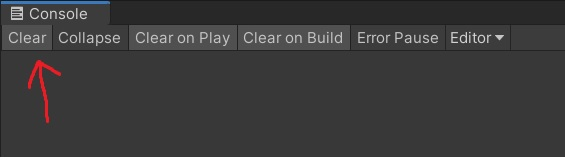
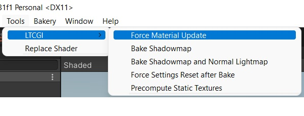
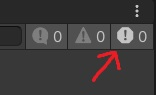
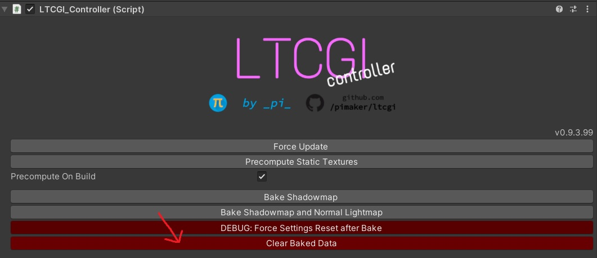
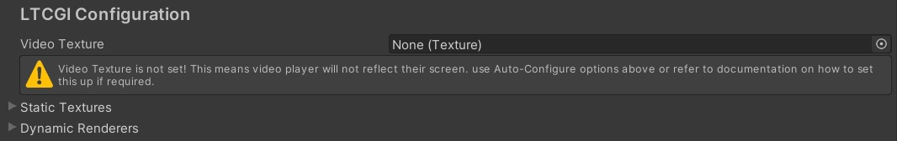

# ❓ Frequently Asked Questions

**If you:**

* Came here searching for answers to your problem: Good! Read on. Perhaps also consider reading the rest of the docs, they explain a lot!
* Have been sent a link to this page on my Discord: Please read through these carefully, either your answer is listed below or it describes how you can make a proper report
* Are just reading this because you're bored: Get some hobbies or something, idk

Alright, here's my list:

### ❓ It doesn't work, nothing works, everything is broken, plz halp?!

**Check the Unity Console!**

No, really. Please do this. Just in general, not just for LTCGI. A lot of problems become very obvious when you actually read the error messages.

For LTCGI, I recommend the following:

- Clear the console

- Force an LTCGI update

- Check the console again, _only_ if it looks like this (no errors!) are you good

### ❓ LTCGI isn't displaying any reflections/lighting after I bake a shadowmap, what do?

Shadowmap baking is the root of all evil - try without it. You can use the "Clear Baked Data" to get rid of previously baked ones:

Only when you're sure everything else is working, and (importantly!) _normal, unrelated to LTCGI, lightmap baking_ using whatever you use to bake _actually works_, feel free to let me know. I will add it as another bullet-point for my ever expanding list of why Unity's handling of lighting data sucks.

### ❓ I hooked up a video player (ProTV/U#Video/what-have-you) but it's not reflecting/lighting up?

First off, (discord) support dedicated to the video player itself can *probably not* help you. Try not to bother them too much with LTCGI requests, please!

Before reporting anything at all, see above for trying without shadowmaps. Then, do the simple test: Add a default Unity Quad (not a plane!) to your scene, add an `LTCGI_Screen` component and set it to light up in some color, static, no video. Is this reflecting? If no: the video player is not the issue, LTCGI is borked instead. Go Back To Start, Do Not Pass Go.

If yes, however: Your video texture input is probably broken. Make sure your controller is not warning you about it like this:

To test, put some static image in that slot and hit CTRL-S. It should reflect that image now. If so, the problem is in how you get the video texture from your player into the LTCGI loopback-CRT. If you have no idea what that means, use one of the premade adapters and try not to change too much, this is the part where it gets complex and you should probably know what you're doing if it breaks ;)

### ❓ I hooked up a video player, and while it is working, it breaks when switching resolution/quality/stream mode?

Video players in VRChat handle these settings by using multiple _video player components_ - which each need to be configured to output to a render texture, and then you need scripting to handle the switching for LTCGI. The included adapters to this for you!

If your video player is not supported by an adapter, you can open a [GitHub Issue](https://github.com/PiMaker/ltcgi/issues) for it, but no guarantees.

If you know some scripting, this is something that can be done manually too - look at the [existing adapter code](https://github.com/PiMaker/ltcgi/tree/main/Adapters) for inspiration!

### ❓ I moved around some stuff/changed some settings but it's not applying to the scene?

LTCGI tries to run stuff automatically, but sometimes you need to help it out - CTRL-S to save forces a material update to run, or you can use the dedicated button:

Then go **check the Unity Console for any errors!**

### ❓ I did a material swap on one of my objects, and now LTCGI is broken?

You need to mark any object in your scene that receives LTCGI lighting but can dynamically swap materials as a "Dynamic Renderers". Check the docs on the [LTCGI Controller](</Getting Started/Setup/Controller#controller-usage>) on how to do this!

### ❓ Why does moving LTCGI screens around lag my editor?

Because I'm a bad programmer that didn't write optimized code. Sorry. Feel free to use the magic of open source to help me make it fast though!