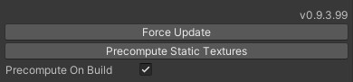
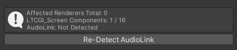
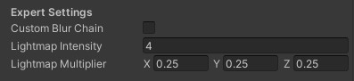
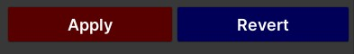

# 3️⃣ Setting up the Controller

The main component of LTCGI is the `LTCGI_Controller`. It controls everything related to LTCGI and bakes the required data into new builds. Note that the controller itself does _not_ get uploaded to VRChat or included into your final build! It only exists in the editor.

## Putting the Controller into your Scene

To begin with, drag the `LTCGI_Controller.prefab` somewhere into your scene. It is recommended to put it into the root of your hierarchy. **You must only ever have 1 of these in your scene!**

<video controls loop width="100%">
  <source src="/vid/drag_in_controller.webm"/>
</video>

Afterwards, your controller should look like this in the Inspector tab:

(note that the version number above "Force Update" may vary)

---

## Controller Usage

| | |
|-|-|
| Version Number (here: `v0.9.3.99`) | The version of LTCGI currently installed. Useful for reporting bugs! |
| Force Update | Updates the state of the scene. Generally, LTCGI tries its best to keep this up-to-date for you automatically, but sometimes materials or objects may get out of sync. If you experience any kind of issue, pressing this button should be your first recourse. Can also be reached via `Tools > LTCGI > Force Material Update` |
| Precompute Static Textures | See section on [Static Textures](/Advanced/Static_Textures). |
| Precompute On Build | Runs "Precompute Static Textures" on build. See section on [Static Textures](/Advanced/Static_Textures). |

---

| | |
|-|-|
| Bake Shadowmap | Starts a shadowmap bake using either the built-in lightmapper or Bakery (if installed). See section on [Shadowmaps](/Advanced/Shadowmaps). |
| Bake Shadowmap and Normal Lightmap | Starts a shadowmap bake using either the built-in lightmapper or Bakery (if installed), then follows it up by a regular light bake. This is _probably_ the button you want. See section on [Shadowmaps](/Advanced/Shadowmaps). |
| DEBUG: Force Settings Reset after Bake | Sometimes a bake will fail and leave your project in an inconsistent state. This button _may_ fix it. If no bake is happening, it should be safe to press this button anyway. |
| Clear Baked Data | Clear all shadowmap data. This will remove any existing shadowmap bakes and reset to unshadowed behaviour. |

---

Info section. Will show you stats about the objects this controller is handling.

Also shows information about [AudioLink](/Advanced/Audiolink), if it is detected, and a button to re-detect if you import it into your project after LTCGI.

---

**LTCGI Configuration** section. Contains general settings you'll probably need for your scene.

| | |
|-|-|
| Video Texture | If you want to make use of real-time video reflections and lighting, you need to put a (Custom) Render Texture in this field. Note that by virtue of this being a single field, you can only ever have a single video input into LTCGI. For more flexibility, you can use UV Maps on your `LTCGI_Screen` components or use the [U# API](/Advanced/Udon_Sharp_API) to change the video texture at runtime. |
| Static Textures | In addition to the one realtime video, you can have multiple static images reflecting as well. **These must be the same size**. See [Static Textures](/Advanced/Static_Textures). |
| Dynamic Renderers | Objects that receive LTCGI lighting but can change materials at runtime (via material swap animations or scripts) need to be listed here. This is a performance optimization, as other objects can be updated at once by setting properties on their shared materials. |

---

Expert Settings. Best to leave alone if you don't know what you're doing!

| | |
|-|-|
| Custom Blur Chain | If checked, the controller will not touch the blur CRTs in the "Prefilter Blur" folder. It is up to you to set them up correctly. This should _not_ be used for changing video texture at runtime, use the [U# API](/Advanced/Udon_Sharp_API) instead! |
| Lightmap Intensity | Apply an intensity multiplier *before* baking the lightmap. Offset with Lightmap Multiplier at runtime. |
| Lightmap Multiplier | Multiply lightmap with this before applying to diffuse. Useful if you have multiple lights next to each other sharing a channel. Applies at runtime, changes are visible immediately in editor. |

---

## Global Shader Options

Affect all lights and renderers in the scene. For advanced users. Note that you need to **click Apply** at the bottom after changing any of these!

