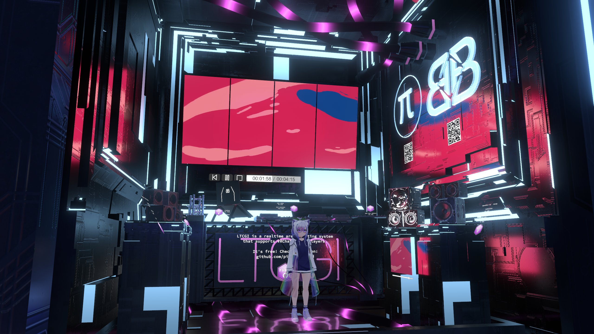

# ✨ About LTCGI

LTCGI is an optimized plug-and-play realtime area light solution using the [linearly transformed cosine algorithm](#LTC) for standalone Unity and VRChat. Free to use with [attribution](#Attribution). It can utilize the Unity build-in lightmapper or [Bakery](https://assetstore.unity.com/packages/tools/level-design/bakery-gpu-lightmapper-122218) for realistic shadows on static objects.

You can [download](https://github.com/PiMaker/ltcgi/raw/main/DemoApp.zip) the standalone demo app pictured above to try it out for yourself.  
Alternatively, join the [demo world](https://vrchat.com/home/launch?worldId=wrld_aa2627ec-c63a-4db2-aa3e-9078d41c6d9c) in VRChat.

LTCGI is distributed freely under a mixed-MIT license. For more details, checkout the [LICENSE](https://github.com/PiMaker/ltcgi/blob/main/LICENSE) file.

## **Getting Started**

The 'Getting Started' row on the left is a good place to start reading. Follow the numbers! (🔢)

I also recommend reading _at least_ the [Performance Optimization](/Advanced/Performance_Optimization) section from the Advanced row.

## **Download**

Make sure you grab a **[compatible shader](https://github.com/PiMaker/ltcgi#supported-shaders)** first! The built-in shaders can be used for testing, but should not be used in production.

For VRChat, you can install LTCGI via the [Creator Companion](https://vcc.docs.vrchat.com/) from my VPM repository:

## ⬇️ **[Creator Companion/VPM Repository](https://vpm.pimaker.at/)**

For **standalone Unity**, you can import LTCGI as a [git package](https://docs.unity3d.com/2019.4/Documentation/Manual/upm-ui-giturl.html) with the URL: `https://github.com/PiMaker/ltcgi.git`

## About this Page

This site is the official documentation for using LTCGI-based lighting in your projects and worlds. It covers everything you should know before using LTCGI. I highly recommend skimming all the pages at least once to gain a basic understanding of what journey you're about to embark on.

> ⚠️ I've tried to keep things simple, but do note that LTCGI is an _advanced_ lighting solution. If this is your first time touching Unity, this may simply not be for you - stuff _will_ break, any you _will_ need to read error messages and troubleshoot things.

Read the [FAQ](/FAQ) before asking for help anywhere!

**Once you've done that**, feel free to join my Discord and ask for help: https://discord.gg/r38vJd2DuJ

> ⚠️ *NOTE: While the shader is optimized, it still equates to real-time lighting - so use sparingly, and read these docs carefully for tips on performance! Often times a reflection probe or a simple realtime light are the better solutions!*

## More glamour shots

